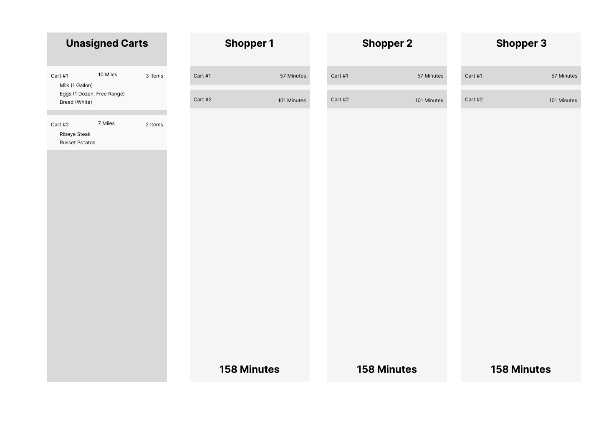
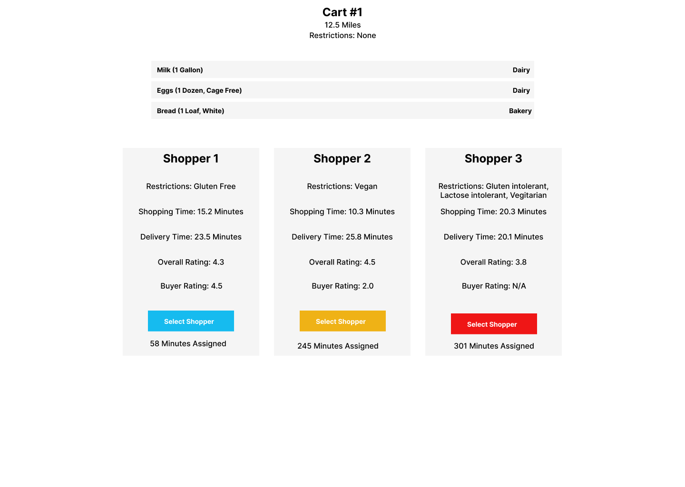

# Shopping Engine

## Background 

Shopping Engine is a management software for in-store shoppers; we allow our client's VIP customers to place orders, match them with a shopper that suits their taste. 

## Your Task

Create 2 Views

1. List View
2. Assignment View 

### List View Requirments

API Calls and Networking are not needed for this prototype, you can use the files located in the data folder and import them directly into the app. 

* A four column or similar layout
  * The First column - a list of unassigned carts
    * Carts should have a list of items assigned to them
    * Clicking on an unassigned cart should transition to the Assignment View for selected cart. 
  * The other columns are each dedicated to an individual shopper
    * Each shopper should have a list of carts assigned to them
    * The carts should display an estimated time in minutes - (items * minute_per_item) + (miles * minute_per_mile)
    * The shopper should have a total estimated time in minutes, achived by adding up the estimated time for all the carts assigned. 

#### Design Sketch

### Assignment View Requirements

* Divided into a Top and a Bottom Section
  * The top section is the selected cart's details 
    * It should display the distance from the store, and any restrictions the buyer has. 
    * It should list out the cart's items with their name and isle. 
  * The bottom section is split into a 3 column layout, with each column being one of the selected shoppers. 
    * Each shopper should display any restrictions the buyer has (so they can be matched up if possible). 
    * Each shopper should also display an estimated delivery time (based off distance and minutes_per_mile) and an estimate shopping time (based off item count and minutes per item) 
    * Additionally, the assignment button should shift into a 'warning' color if they're currently assigned more than 240 minutes, and an 'error' color if they're currently assigned more than 300 minutes. 

#### Design Sketch 

1. Button Color should change to a warning-like color after a shopper has been assigned more than 240 minutes of work (4 Hours)
2. Button Color should change to a error-like color after a shopper has been assigned more than 300 minutes of work (5 Hours)
3. Optional: Highlight any shared restrictions. 
